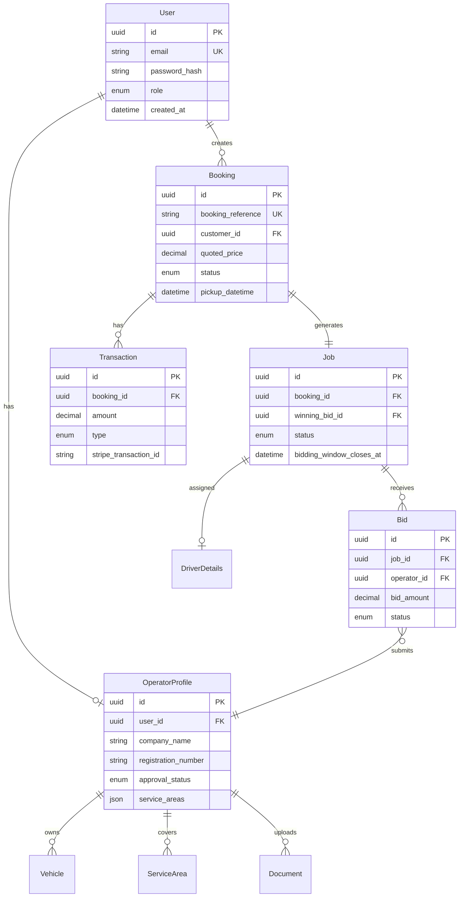

# DATABASE SCHEMA DOCUMENTATION

**Version:** 2.0
**Last Updated:** December 2025
**Database:** PostgreSQL 15+
**ORM:** Prisma 5+
**Schema Audit Status:** ✅ Production-Grade

---

## TABLE OF CONTENTS

1. [Overview](#overview)
2. [Entity-Relationship Diagram](#entity-relationship-diagram)
3. [Complete Prisma Schema](#complete-prisma-schema)
4. [Model Explanations](#model-explanations)
5. [Relationships](#relationships)
6. [Indexes & Performance](#indexes--performance)
7. [Sample Queries](#sample-queries)

---

## 1. OVERVIEW

### Database Design Principles

- **Normalization**: 3NF (Third Normal Form) to minimize data redundancy
- **Referential Integrity**: Foreign key constraints ensure data consistency
- **ACID Compliance**: Critical for financial transactions (payments, refunds, payouts)
- **Scalability**: Proper indexing for query performance
- **Audit Trail**: Created/updated timestamps on all tables
- **State Machines**: Proper enums for lifecycle management (not booleans)
- **Financial Tracking**: Platform margin stored on Job for revenue analysis

### Naming Conventions

- **Tables**: Singular PascalCase in Prisma schema (e.g., `User`, `Booking`)
- **Table Mapping**: snake_case for PostgreSQL via `@@map` (e.g., `@@map("users")`)
- **Columns**: camelCase in Prisma (e.g., `firstName`, `createdAt`)
- **Foreign Keys**: Suffix with `Id` (e.g., `userId`, `operatorId`)
- **Booleans**: Prefix with `is` or `has` (e.g., `isActive`, `hasMeetAndGreet`)
- **Timestamps**: Suffix with `At` (e.g., `createdAt`, `updatedAt`, `completedAt`)

### Key Data Types

- **IDs**: CUID (Collision-resistant Unique Identifier) for all primary keys - URL-safe, sortable
- **Decimals**: `Decimal` type for monetary values (precision: 10, scale: 2)
- **Timestamps**: `DateTime` with timezone support
- **Enums**: PostgreSQL enums for fixed value sets (proper state machines)
- **JSON**: `Json` type for flexible data (special requirements, metadata)

---

## 2. ENTITY-RELATIONSHIP DIAGRAM

### Core Entities

```
User (Customer/Operator/Admin)
  ↓
  ├─→ Booking (Customer creates booking)
  │     ↓
  │     ├─→ Job (Created from paid booking)
  │     │    ↓
  │     │    ├─→ Bid (Operators submit bids)
  │     │    │
  │     │    └─→ DriverDetails (Assigned after bid won)
  │     │
  │     └─→ Transaction (Payment, Refund)
  │
  └─→ OperatorProfile (If user role is OPERATOR)
        ↓
        ├─→ Vehicle (Operator's fleet)
        ├─→ ServiceArea (Regions covered)
        └─→ Document (License, Insurance)

PricingRule (Admin configures)
Notification (Email/SMS logs)
```

### Mermaid ER Diagram



---

## 3. COMPLETE PRISMA SCHEMA

Below is the complete Prisma schema ready to copy into `prisma/schema.prisma`:


```prisma
// This is your Prisma schema file
// learn more about it in the docs: https://pris.ly/d/prisma-schema

generator client {
  provider = "prisma-client-js"
}

datasource db {
  provider = "postgresql"
  url      = env("DATABASE_URL")
}

// ============================================================================
// ENUMS
// ============================================================================

enum UserRole {
  CUSTOMER
  OPERATOR
  ADMIN
}

enum BookingStatus {
  PENDING_PAYMENT
  PAID
  ASSIGNED
  IN_PROGRESS
  COMPLETED
  CANCELLED
  REFUNDED
}

enum JobStatus {
  OPEN_FOR_BIDDING    // Job is accepting bids
  BIDDING_CLOSED      // Bidding window expired, processing winner
  NO_BIDS_RECEIVED    // No operators bid - requires admin escalation
  ASSIGNED            // Operator assigned
  IN_PROGRESS         // Journey in progress
  COMPLETED           // Journey completed
  CANCELLED           // Job cancelled
}

enum BidStatus {
  PENDING
  WON
  LOST
  WITHDRAWN
}

enum VehicleType {
  SALOON
  ESTATE
  MPV
  EXECUTIVE
  MINIBUS
}

enum ServiceType {
  AIRPORT_PICKUP
  AIRPORT_DROPOFF
  POINT_TO_POINT
}

enum JourneyType {
  ONE_WAY
  OUTBOUND
  RETURN
}

enum BookingGroupStatus {
  ACTIVE
  PARTIALLY_CANCELLED
  FULLY_CANCELLED
  COMPLETED
}

enum DiscountType {
  RETURN_JOURNEY
  PROMOTIONAL
}

enum TransactionType {
  CUSTOMER_PAYMENT
  OPERATOR_PAYOUT
  REFUND
  PLATFORM_COMMISSION
}

enum TransactionStatus {
  PENDING
  COMPLETED
  FAILED
  CANCELLED
}

enum DocumentType {
  OPERATING_LICENSE
  INSURANCE
  OTHER
}

enum NotificationStatus {
  PENDING
  SENT
  FAILED
  BOUNCED
}

enum NotificationType {
  EMAIL
  SMS
}

enum OperatorApprovalStatus {
  PENDING     // Awaiting admin review
  APPROVED    // Active and can bid
  REJECTED    // Application rejected
  SUSPENDED   // Temporarily blocked from bidding
}

// ============================================================================
// MODELS
// ============================================================================

model User {
  id                String    @id @default(cuid())
  email             String    @unique
  password          String
  firstName         String
  lastName          String
  phoneNumber       String?
  role              UserRole
  isEmailVerified   Boolean   @default(false)
  isActive          Boolean   @default(true)
  createdAt         DateTime  @default(now())
  updatedAt         DateTime  @updatedAt

  // Relations
  operatorProfile   OperatorProfile?
  bookings          Booking[]
  bookingGroups     BookingGroup[]
  notifications     Notification[]

  @@map("users")
}

model OperatorProfile {
  id                  String    @id @default(cuid())
  userId              String    @unique
  companyName         String
  registrationNumber  String
  vatNumber           String?
  approvalStatus      OperatorApprovalStatus @default(PENDING)
  reputationScore     Decimal   @default(5.0) @db.Decimal(3, 2)
  totalJobs           Int       @default(0)
  completedJobs       Int       @default(0)

  // Bank details for payouts
  bankAccountName     String?
  bankAccountNumber   String?
  bankSortCode        String?

  createdAt           DateTime  @default(now())
  updatedAt           DateTime  @updatedAt

  // Relations
  user                User      @relation(fields: [userId], references: [id], onDelete: Cascade)
  vehicles            Vehicle[]
  documents           Document[]
  serviceAreas        ServiceArea[]
  bids                Bid[]
  assignedJobs        Job[]     @relation("AssignedOperator")

  @@index([approvalStatus])
  @@index([userId])
  @@map("operator_profiles")
}

model Vehicle {
  id                String    @id @default(cuid())
  operatorId        String
  vehicleType       VehicleType
  registrationPlate String
  make              String
  model             String
  year              Int
  isActive          Boolean   @default(true)
  createdAt         DateTime  @default(now())
  updatedAt         DateTime  @updatedAt

  // Relations
  operator          OperatorProfile @relation(fields: [operatorId], references: [id], onDelete: Cascade)

  @@map("vehicles")
}

model ServiceArea {
  id                String    @id @default(cuid())
  operatorId        String
  postcode          String
  createdAt         DateTime  @default(now())

  // Relations
  operator          OperatorProfile @relation(fields: [operatorId], references: [id], onDelete: Cascade)

  @@map("service_areas")
}

model Document {
  id                String    @id @default(cuid())
  operatorId        String
  documentType      DocumentType
  fileUrl           String
  fileName          String
  uploadedAt        DateTime  @default(now())
  expiresAt         DateTime?

  // Relations
  operator          OperatorProfile @relation(fields: [operatorId], references: [id], onDelete: Cascade)

  @@map("documents")
}

// Booking Group for return journeys (links outbound + return bookings)
model BookingGroup {
  id                String    @id @default(cuid())
  groupReference    String    @unique  // TTS-GRP-XXXXXX
  customerId        String
  totalPrice        Decimal   @db.Decimal(10, 2)
  discountType      DiscountType?
  discountAmount    Decimal?  @db.Decimal(10, 2)
  status            BookingGroupStatus @default(ACTIVE)
  createdAt         DateTime  @default(now())
  updatedAt         DateTime  @updatedAt

  // Relations
  customer          User      @relation(fields: [customerId], references: [id], onDelete: Cascade)
  bookings          Booking[]

  @@map("booking_groups")
}

model Booking {
  id                  String    @id @default(cuid())
  customerId          String
  bookingReference    String    @unique

  // Journey type for return journey support
  journeyType         JourneyType @default(ONE_WAY)
  bookingGroupId      String?    // Null for one-way, set for return journeys
  linkedBookingId     String?    @unique  // Links outbound <-> return

  // Journey details
  pickupAddress       String
  pickupPostcode      String
  pickupLat           Decimal   @db.Decimal(10, 8)
  pickupLng           Decimal   @db.Decimal(11, 8)
  dropoffAddress      String
  dropoffPostcode     String
  dropoffLat          Decimal   @db.Decimal(10, 8)
  dropoffLng          Decimal   @db.Decimal(11, 8)
  pickupDatetime      DateTime
  passengerCount      Int
  luggageCount        Int
  vehicleType         VehicleType
  serviceType         ServiceType
  flightNumber        String?
  specialRequirements String?

  // Quote calculation data (audit trail)
  distanceMiles       Decimal?  @db.Decimal(10, 2)
  durationMinutes     Int?

  // Lead passenger contact (may differ from booking user)
  customerName        String?
  customerEmail       String?
  customerPhone       String?

  // Airport-specific fields
  terminal            String?
  hasMeetAndGreet     Boolean   @default(false)

  customerPrice       Decimal   @db.Decimal(10, 2)  // Price for THIS leg only
  status              BookingStatus @default(PENDING_PAYMENT)
  createdAt           DateTime  @default(now())
  updatedAt           DateTime  @updatedAt

  // Relations
  customer            User      @relation(fields: [customerId], references: [id], onDelete: Cascade)
  bookingGroup        BookingGroup? @relation(fields: [bookingGroupId], references: [id], onDelete: SetNull)
  linkedBooking       Booking?  @relation("LinkedBookings", fields: [linkedBookingId], references: [id])
  pairedBooking       Booking?  @relation("LinkedBookings")
  job                 Job?
  transactions        Transaction[]

  @@index([customerId])
  @@index([status])
  @@index([pickupDatetime])
  @@index([bookingGroupId])
  @@map("bookings")
}

model Job {
  id                        String    @id @default(cuid())
  bookingId                 String    @unique
  status                    JobStatus @default(OPEN_FOR_BIDDING)

  // Bidding window configuration
  biddingWindowOpensAt      DateTime  @default(now())
  biddingWindowClosesAt     DateTime
  biddingWindowDurationHours Int      @default(24)

  // Assignment details
  assignedOperatorId        String?
  winningBidId              String?   @unique

  // Financial tracking
  platformMargin            Decimal?  @db.Decimal(10, 2)  // Customer Price - Winning Bid

  completedAt               DateTime?
  createdAt                 DateTime  @default(now())
  updatedAt                 DateTime  @updatedAt

  // Relations
  booking                   Booking   @relation(fields: [bookingId], references: [id], onDelete: Cascade)
  assignedOperator          OperatorProfile? @relation("AssignedOperator", fields: [assignedOperatorId], references: [id])
  winningBid                Bid?      @relation("WinningBid", fields: [winningBidId], references: [id])
  bids                      Bid[]     @relation("JobBids")
  driverDetails             DriverDetails?

  @@index([status])
  @@index([assignedOperatorId])
  @@index([biddingWindowClosesAt])
  @@map("jobs")
}

model Bid {
  id                String    @id @default(cuid())
  jobId             String
  operatorId        String
  bidAmount         Decimal   @db.Decimal(10, 2)
  status            BidStatus @default(PENDING)
  notes             String?   // Operator notes/comments on bid
  submittedAt       DateTime  @default(now())
  updatedAt         DateTime  @updatedAt

  // Relations
  job               Job       @relation("JobBids", fields: [jobId], references: [id], onDelete: Cascade)
  operator          OperatorProfile @relation(fields: [operatorId], references: [id], onDelete: Cascade)
  wonJob            Job?      @relation("WinningBid")

  @@unique([jobId, operatorId])
  @@index([operatorId])
  @@index([status])
  @@map("bids")
}

// Driver details assigned to a specific job (not operator-level)
model DriverDetails {
  id                  String    @id @default(cuid())
  jobId               String    @unique
  driverName          String
  driverPhone         String
  vehicleRegistration String
  vehicleMake         String?
  vehicleModel        String?
  vehicleColor        String?
  createdAt           DateTime  @default(now())
  updatedAt           DateTime  @updatedAt

  // Relations
  job                 Job       @relation(fields: [jobId], references: [id], onDelete: Cascade)

  @@map("driver_details")
}

model Transaction {
  id                    String    @id @default(cuid())
  bookingId             String
  transactionType       TransactionType
  amount                Decimal   @db.Decimal(10, 2)
  currency              String    @default("GBP")
  stripeTransactionId   String?
  stripePaymentIntentId String?
  status                TransactionStatus @default(PENDING)
  description           String?
  metadata              Json?
  completedAt           DateTime?
  createdAt             DateTime  @default(now())
  updatedAt             DateTime  @updatedAt

  // Relations
  booking               Booking   @relation(fields: [bookingId], references: [id], onDelete: Cascade)

  @@index([bookingId])
  @@index([transactionType])
  @@index([status])
  @@map("transactions")
}

model PricingRule {
  id                String    @id @default(cuid())
  ruleType          String    // BASE_FARE, PER_MILE, TIME_SURCHARGE, HOLIDAY_SURCHARGE, AIRPORT_FEE, etc.
  vehicleType       VehicleType?
  baseValue         Decimal   @db.Decimal(10, 2)
  percentage        Decimal?  @db.Decimal(5, 2)  // For percentage-based rules
  startTime         String?   // For time-based surcharges (HH:mm format)
  endTime           String?   // For time-based surcharges (HH:mm format)
  startDate         DateTime? // For holiday surcharges
  endDate           DateTime? // For holiday surcharges
  airportCode       String?   // For airport-specific fees
  description       String?
  isActive          Boolean   @default(true)
  createdAt         DateTime  @default(now())
  updatedAt         DateTime  @updatedAt

  @@index([ruleType])
  @@index([isActive])
  @@map("pricing_rules")
}

model Notification {
  id                String    @id @default(cuid())
  userId            String
  type              NotificationType @default(EMAIL)
  subject           String
  message           String
  recipientEmail    String?
  recipientPhone    String?
  templateId        String?
  metadata          Json?
  status            NotificationStatus @default(PENDING)
  sentAt            DateTime?
  failedAt          DateTime?
  errorMessage      String?
  createdAt         DateTime  @default(now())

  // Relations
  user              User      @relation(fields: [userId], references: [id], onDelete: Cascade)

  @@index([userId])
  @@index([status])
  @@index([type])
  @@map("notifications")
}
```

---

## 4. MODEL EXPLANATIONS

### User Model

**Purpose**: Central authentication and user management for all roles (Customer, Operator, Admin).

**Key Fields**:
- `id`: CUID primary key (collision-resistant, URL-safe)
- `email`: Unique identifier for login
- `password`: Bcrypt hashed password (never store plain text)
- `role`: Enum (CUSTOMER, OPERATOR, ADMIN) - determines access permissions
- `isEmailVerified`: Email verification status (for security)
- `isActive`: Soft deactivation flag (admin can deactivate accounts)

**Relationships**:
- One-to-Many with `Booking` (customers create bookings)
- One-to-Many with `BookingGroup` (for return journey groups)
- One-to-One with `OperatorProfile` (if role is OPERATOR)
- One-to-Many with `Notification`

**Business Rules**:
- Email must be unique across all users
- Password must be hashed using bcrypt (min 10 rounds)
- Email verification required before certain actions (optional for MVP)

---

### OperatorProfile Model

**Purpose**: Extended profile for transport operators with company details, approval workflow, and payout info.

**Key Fields**:
- `userId`: Foreign key to User (one-to-one relationship)
- `companyName`: Legal business name
- `registrationNumber`: Company registration (e.g., Companies House number)
- `approvalStatus`: Enum (PENDING, APPROVED, REJECTED, SUSPENDED) - proper state machine
- `reputationScore`: Decimal 0.00-5.00 (used as tiebreaker in bidding)
- `totalJobs` / `completedJobs`: Job statistics for performance tracking
- `bankAccountName`, `bankAccountNumber`, `bankSortCode`: Bank details for payouts

**Relationships**:
- One-to-One with `User`
- One-to-Many with `Vehicle` (operator's fleet)
- One-to-Many with `ServiceArea` (postcodes covered)
- One-to-Many with `Document` (uploaded documents)
- One-to-Many with `Bid` (bids submitted)
- One-to-Many with `Job` (assigned jobs)

**Business Rules**:
- Operator must be APPROVED before they can view jobs and submit bids
- Admin can SUSPEND operators (prevents bidding but preserves data)
- Admin can REJECT operators (application denied)
- Reputation score starts at 5.0, adjusts based on performance
- Bank details required before first payout

---

### BookingGroup Model (Return Journey Support)

**Purpose**: Groups outbound and return bookings together for return journeys.

**Key Fields**:
- `groupReference`: Unique reference (e.g., "TTS-GRP-XXXXXX") - customer-facing ID
- `customerId`: Foreign key to User
- `totalPrice`: Combined price for both legs (after 5% discount)
- `discountType`: RETURN_JOURNEY (5% discount) or PROMOTIONAL
- `discountAmount`: Actual discount amount in GBP
- `status`: Enum (ACTIVE, PARTIALLY_CANCELLED, FULLY_CANCELLED, COMPLETED)

**Relationships**:
- Many-to-One with `User` (customer)
- One-to-Many with `Booking` (outbound + return bookings)

**Business Rules**:
- Created when customer books a return journey
- Contains exactly 2 bookings (outbound + return)
- Status auto-updates based on constituent booking statuses
- Single payment for entire group

---

### Booking Model

**Purpose**: Customer's booking request with journey details and pricing.

**Key Fields**:
- `bookingReference`: Unique alphanumeric code (e.g., "TTS-XXXXXX") - customer-facing ID
- `journeyType`: ONE_WAY, OUTBOUND, or RETURN
- `bookingGroupId`: Foreign key to BookingGroup (null for one-way)
- `linkedBookingId`: Links outbound ↔ return booking
- `status`: Enum tracking booking lifecycle (PENDING_PAYMENT → PAID → ASSIGNED → COMPLETED)
- `pickupAddress`, `pickupLat`, `pickupLng`: Full address and coordinates
- `dropoffAddress`, `dropoffLat`, `dropoffLng`: Destination with coordinates
- `pickupDatetime`: When customer wants to be picked up
- `customerPrice`: Final price customer paid (includes all surcharges, discounts)
- `flightNumber`: TEXT ONLY - no API integration, no validation
- `specialRequirements`: Text field for special requests

**Relationships**:
- Many-to-One with `User` (customer)
- Many-to-One with `BookingGroup` (for return journeys)
- One-to-One self-referencing (linked outbound ↔ return)
- One-to-One with `Job` (created after payment)
- One-to-Many with `Transaction` (payment, refund)

**Business Rules**:
- Booking reference must be unique and easily readable (avoid ambiguous characters)
- Status transitions: PENDING_PAYMENT → PAID (after Stripe payment) → ASSIGNED (after bid won) → IN_PROGRESS → COMPLETED
- Customer price is immutable after payment (no price changes)
- Return journey gets 5% discount applied via BookingGroup
- Each booking (outbound/return) has its own independent Job for bidding

---

### Job Model

**Purpose**: Represents a paid booking that is broadcast to operators for bidding. Core of the competitive bidding system.

**Key Fields**:
- `bookingId`: One-to-one with Booking (created when booking status = PAID)
- `status`: Enum with full lifecycle:
  - `OPEN_FOR_BIDDING` - Accepting bids from operators
  - `BIDDING_CLOSED` - Window expired, processing winner
  - `NO_BIDS_RECEIVED` - No operators bid, escalated to admin
  - `ASSIGNED` - Winner selected and confirmed
  - `IN_PROGRESS` - Journey underway
  - `COMPLETED` - Journey finished
  - `CANCELLED` - Job cancelled
- `biddingWindowOpensAt`: When bidding starts
- `biddingWindowClosesAt`: Deadline for bid submissions
- `biddingWindowDurationHours`: Configurable (2-24 hours based on urgency)
- `assignedOperatorId`: Foreign key to winning operator
- `winningBidId`: Foreign key to winning Bid
- `platformMargin`: **Revenue Tracking** - Calculated as (Customer Price - Winning Bid Amount)
- `completedAt`: When job was marked complete

**Relationships**:
- One-to-One with `Booking`
- Many-to-One with `OperatorProfile` (assigned operator)
- One-to-Many with `Bid` (operators submit bids)
- One-to-One with `Bid` (winning bid)
- One-to-One with `DriverDetails` (per-job driver assignment)

**Business Rules**:
- Job created automatically when Booking status changes to PAID
- Bidding window duration calculated based on pickupDatetime (shorter window for urgent jobs)
- Status changes to BIDDING_CLOSED when window expires
- Winner selected automatically: lowest bid wins (tiebreaker: reputationScore)
- If no bids received: status = NO_BIDS_RECEIVED, admin receives escalation notification
- Platform margin is stored for revenue analysis and reporting

---

### Bid Model

**Purpose**: Operator's bid submission for a job.

**Key Fields**:
- `jobId`: Foreign key to Job
- `operatorId`: Foreign key to OperatorProfile
- `bidAmount`: Operator's proposed price (must be ≤ customer's customerPrice)
- `status`: Enum (PENDING, WON, LOST, WITHDRAWN)
- `notes`: Optional notes from operator (e.g., "Can provide luxury vehicle")
- `submittedAt`: Timestamp when bid was submitted

**Relationships**:
- Many-to-One with `Job`
- Many-to-One with `OperatorProfile`
- One-to-One with `Job` (if this bid wins)

**Business Rules**:
- Unique constraint: one bid per operator per job (@@unique([jobId, operatorId]))
- Bid amount must be ≤ booking.customerPrice (validated in backend)
- Bid amount must be > 0
- Operator can only bid if approvalStatus = APPROVED
- Operator can only bid if job is in their service area
- Operator can withdraw bid before bidding window closes (status = WITHDRAWN)
- All losing bids automatically set to status = LOST when winner selected

---

### DriverDetails Model

**Purpose**: Driver and vehicle information assigned to a specific job (not operator-level).

**Key Fields**:
- `jobId`: One-to-one with Job
- `driverName`: Driver's full name
- `driverPhone`: Driver's contact number
- `vehicleRegistration`: License plate
- `vehicleMake`, `vehicleModel`, `vehicleColor`: Vehicle details

**Business Rules**:
- Driver details are per-job, not per-operator (operators may use different drivers)
- Required before job can start (IN_PROGRESS)
- Customer receives driver details 24 hours before pickup

---

### Transaction Model

**Purpose**: Financial transaction log for payments, refunds, and payouts.

**Key Fields**:
- `bookingId`: Foreign key to Booking
- `transactionType`: Enum (CUSTOMER_PAYMENT, OPERATOR_PAYOUT, REFUND, PLATFORM_COMMISSION)
- `status`: Enum (PENDING, COMPLETED, FAILED, CANCELLED)
- `amount`: Transaction amount in GBP
- `stripeTransactionId`: Stripe charge/transfer ID for reconciliation
- `stripePaymentIntentId`: Stripe Payment Intent ID
- `completedAt`: When transaction was completed

**Relationships**:
- Many-to-One with `Booking`

**Business Rules**:
- All financial transactions must be logged (audit trail)
- CUSTOMER_PAYMENT created when Stripe payment succeeds
- OPERATOR_PAYOUT created when payout processed (weekly/bi-weekly)
- REFUND created when booking cancelled (full or partial)
- PLATFORM_COMMISSION calculated as (Customer Payment - Operator Payout)

---

### PricingRule Model

**Purpose**: Admin-configurable pricing rules for quote calculation.

**Key Fields**:
- `ruleType`: Type of pricing rule (BASE_FARE, PER_MILE, TIME_SURCHARGE, HOLIDAY_SURCHARGE, AIRPORT_FEE)
- `vehicleType`: Specific vehicle type (null for global rules)
- `baseValue`: Fixed amount (e.g., £5.00 base fare)
- `percentage`: Percentage for surcharges (e.g., 50.00 for 50% holiday surcharge)
- `startTime` / `endTime`: For time-based surcharges (e.g., night rates 22:00-06:00)
- `startDate` / `endDate`: For date-based surcharges (e.g., Christmas period)
- `airportCode`: For airport-specific fees (e.g., "LHR" = £5.00 fee)
- `isActive`: Toggle rule on/off without deletion

**Business Rules**:
- Multiple rules can apply to a single quote (base fare + per-mile + surcharges)
- Rules are additive (all applicable rules are summed)
- Admin can activate/deactivate rules without deleting them
- Time-based rules use 24-hour format (HH:mm)

---

### Notification Model

**Purpose**: Track all email and SMS notifications sent to users.

**Key Fields**:
- `userId`: Foreign key to User
- `type`: Enum (EMAIL, SMS)
- `status`: Enum (PENDING, SENT, FAILED, BOUNCED)
- `subject`: Email subject line
- `message`: Notification content
- `recipientEmail` / `recipientPhone`: Delivery address
- `templateId`: SendGrid template ID (for templated emails)
- `sentAt` / `failedAt`: Delivery timestamps
- `errorMessage`: Error details if failed

**Business Rules**:
- Retry failed notifications up to 3 times
- Log all delivery attempts for audit
- Users can opt-out of SMS notifications

---

## 5. RELATIONSHIPS

### One-to-One Relationships

1. **User ↔ OperatorProfile**: Each operator user has exactly one profile
2. **Booking ↔ Job**: Each paid booking generates exactly one job
3. **Job ↔ DriverDetails**: Each assigned job has exactly one driver assignment (per-job, not per-operator)
4. **Job ↔ Bid (winning)**: Each job has at most one winning bid
5. **Booking ↔ Booking (linked)**: Outbound links to return booking

### One-to-Many Relationships

1. **User → Booking**: Customer can create multiple bookings
2. **User → BookingGroup**: Customer can have multiple booking groups
3. **OperatorProfile → Vehicle**: Operator can have multiple vehicles
4. **OperatorProfile → ServiceArea**: Operator can cover multiple postcodes
5. **OperatorProfile → Document**: Operator can upload multiple documents
6. **OperatorProfile → Bid**: Operator can submit multiple bids
7. **OperatorProfile → Job**: Operator can be assigned multiple jobs
8. **Job → Bid**: Each job can receive multiple bids
9. **Booking → Transaction**: Each booking can have multiple transactions
10. **BookingGroup → Booking**: Each group contains outbound + return bookings

---

## 6. INDEXES & PERFORMANCE

### Index Strategy

**Primary Indexes (Automatic)**:
- All `@id` fields automatically indexed (CUID primary keys)
- All `@unique` fields automatically indexed

**Custom Indexes Added**:

```prisma
// OperatorProfile
@@index([approvalStatus])  // Filter approved operators
@@index([userId])          // Join with User

// Booking
@@index([customerId])      // Customer's bookings
@@index([status])          // Filter by status
@@index([pickupDatetime])  // Upcoming bookings
@@index([bookingGroupId])  // Return journey grouping

// Job
@@index([status])          // Filter open jobs
@@index([assignedOperatorId]) // Operator's assigned jobs
@@index([biddingWindowClosesAt]) // Find expiring jobs

// Bid
@@index([operatorId])      // Operator's bids
@@index([status])          // Filter by status

// Transaction
@@index([bookingId])       // Booking's transactions
@@index([transactionType]) // Filter by type
@@index([status])          // Filter by status

// Notification
@@index([userId])          // User's notifications
@@index([status])          // Filter by status
@@index([type])            // Filter by type

// PricingRule
@@index([ruleType])        // Filter by rule type
@@index([isActive])        // Active rules only
```

### Performance Considerations

1. **Composite Indexes**: Consider adding composite indexes for common query patterns:
   - `@@index([status, pickupDatetime])` on Booking (filter + sort)
   - `@@index([jobId, status])` on Bid (filter bids by job and status)

2. **Query Optimization**:
   - Use `select` to fetch only needed fields
   - Use `include` sparingly (avoid N+1 queries)
   - Implement pagination for list queries (cursor-based or offset-based)

3. **Database Connection Pooling**:
   - Configure Prisma connection pool size based on expected load
   - Use PgBouncer for connection pooling in production

---

## 7. SAMPLE QUERIES

### Common Query Patterns

**1. Get Customer's Bookings with Job and Bid Details**

```typescript
const bookings = await prisma.booking.findMany({
  where: {
    customerId: userId,
    status: {
      in: ['PAID', 'ASSIGNED', 'IN_PROGRESS']
    }
  },
  include: {
    job: {
      include: {
        winningBid: {
          include: {
            operator: {
              select: {
                companyName: true,
                user: {
                  select: {
                    phoneNumber: true
                  }
                }
              }
            }
          }
        },
        driverDetails: true
      }
    }
  },
  orderBy: {
    pickupDatetime: 'asc'
  }
});
```

**2. Get Open Jobs for Operator (in their service area)**

```typescript
const openJobs = await prisma.job.findMany({
  where: {
    status: 'OPEN_FOR_BIDDING',
    biddingWindowClosesAt: {
      gt: new Date() // Not expired
    },
    booking: {
      pickupPostcode: {
        startsWith: 'SW' // Operator's service area
      },
      vehicleType: {
        in: ['SALOON', 'ESTATE'] // Operator's vehicle types
      }
    },
    bids: {
      none: {
        operatorId: operatorId // Operator hasn't bid yet
      }
    }
  },
  include: {
    booking: {
      select: {
        bookingReference: true,
        pickupAddress: true,
        dropoffAddress: true,
        pickupDatetime: true,
        passengerCount: true,
        luggageCount: true,
        vehicleType: true,
        customerPrice: true
      }
    },
    _count: {
      select: {
        bids: true // Number of bids received
      }
    }
  },
  orderBy: {
    biddingWindowClosesAt: 'asc' // Most urgent first
  }
});
```

**3. Select Winning Bid (Lowest Bid with Tiebreaker)**

```typescript
const winningBid = await prisma.bid.findFirst({
  where: {
    jobId: jobId,
    status: 'PENDING'
  },
  orderBy: [
    { bidAmount: 'asc' },           // Lowest bid first
    { operator: { reputationScore: 'desc' } } // Tiebreaker: highest reputation
  ],
  include: {
    operator: true
  }
});

// Update job with winning bid and calculate platform margin
await prisma.job.update({
  where: { id: jobId },
  data: {
    winningBidId: winningBid.id,
    assignedOperatorId: winningBid.operatorId,
    status: 'ASSIGNED',
    platformMargin: booking.customerPrice.sub(winningBid.bidAmount)  // Revenue tracking
  }
});

// Update bid statuses
await prisma.bid.updateMany({
  where: {
    jobId: jobId,
    id: { not: winningBid.id }
  },
  data: { status: 'LOST' }
});

await prisma.bid.update({
  where: { id: winningBid.id },
  data: { status: 'WON' }
});
```

**4. Admin Dashboard KPIs**

```typescript
const [
  totalBookings,
  totalRevenue,
  activeOperators,
  pendingApprovals,
  openJobs,
  escalatedJobs
] = await Promise.all([
  prisma.booking.count({
    where: { status: { not: 'PENDING_PAYMENT' } }
  }),
  prisma.job.aggregate({
    where: { status: 'COMPLETED' },
    _sum: { platformMargin: true }  // Total platform revenue
  }),
  prisma.operatorProfile.count({
    where: { approvalStatus: 'APPROVED', user: { isActive: true } }
  }),
  prisma.operatorProfile.count({
    where: { approvalStatus: 'PENDING' }
  }),
  prisma.job.count({
    where: { status: 'OPEN_FOR_BIDDING' }
  }),
  prisma.job.count({
    where: { status: 'NO_BIDS_RECEIVED' }  // Escalated jobs requiring admin attention
  })
]);
```

**5. Calculate Quote (with Pricing Rules)**

```typescript
const pricingRules = await prisma.pricingRule.findMany({
  where: {
    isActive: true,
    OR: [
      { vehicleType: vehicleType },
      { vehicleType: null } // Global rules
    ]
  }
});

// Apply rules in backend service
let totalPrice = new Decimal(0);

// Base fare
const baseFare = pricingRules.find(r => r.ruleType === 'BASE_FARE');
totalPrice = totalPrice.add(baseFare.baseValue);

// Per-mile rate
const perMileRate = pricingRules.find(r => r.ruleType === 'PER_MILE');
totalPrice = totalPrice.add(perMileRate.baseValue.mul(distanceMiles));

// Time surcharges (night rate, peak hours)
// Holiday surcharges
// Airport fees
// Apply return journey discount (5%)
```

---

**Document Status**: ✅ Complete and Updated (December 2025)
**Schema Version**: 2.0 (Production-Grade)
**Key Changes from v1.0**:
- CUID for IDs (not UUID)
- camelCase field naming (not snake_case)
- `OperatorApprovalStatus` enum (replaces boolean `isApproved`)
- `JobStatus.NO_BIDS_RECEIVED` for escalation workflow
- `platformMargin` on Job for revenue tracking
- `DriverDetails` linked to Job (per-job assignment, not operator-level)
- Bank details on OperatorProfile for payouts
- Proper indexes for query performance
